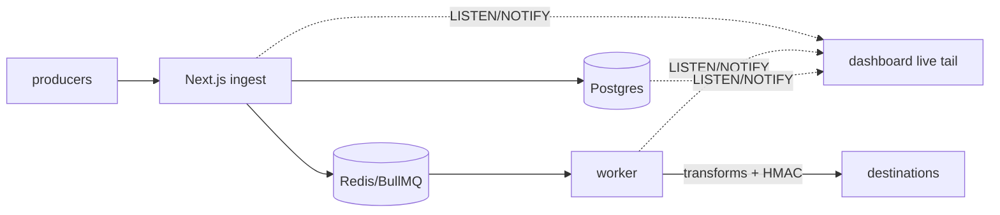

# HookRelay — durable webhook gateway

Self-hostable webhook ingestion, routing and replay: receive → verify → queue → transform → deliver with retries, live tail and replay.

> Status: end-to-end pipeline live — HMAC verify → rate-limit → idempotency → Postgres + BullMQ → worker delivery (exp backoff ×5, DLQ) → dashboard with SSE live tail, charts, replay + sandboxed per-endpoint transforms.

<!-- TODO: demo GIF (docs/demo.gif) → pnpm dev, fire a few events, screen-record -->

## Quickstart

```bash
cp apps/web/.env.example apps/web/.env
docker compose -f infra/docker-compose.yml up -d postgres redis
pnpm install
pnpm --filter @hook-relay/web db:migrate
pnpm seed   # prints a signed curl for the demo source
# web → http://localhost:3000  ·  worker: RETRY_DELAYS_SEC=2,2,2,2,2 pnpm dev
curl localhost:3000/api/health
```

Signed ingest (unsigned requests get `401`; `pnpm seed` prints a ready-to-paste example):

```bash
curl -X POST localhost:3000/api/ingest/demo \
  -H 'content-type: application/json' \
  -H 'x-hookrelay-signature: sha256=<hex>' \
  -H 'idempotency-key: my-key-1' \
  -d '{"hello":"world"}'
# repeat with the same idempotency-key → 200 {"deduped":true, ...}, no duplicate delivery
```

Signatures are HMAC-SHA256 of the raw body (`hookrelay-js`):

```ts
import { sign } from "hookrelay-js";
await sign(SECRET, rawBody); // → "sha256=…"
```

## CLI

```bash
pnpm --filter @hook-relay/cli build
node packages/cli/dist/index.js listen --port 9200           # local receiver
node packages/cli/dist/index.js trigger '{"ping":1}' \
  --secret demo_secret_local_only --source demo
```

## E2E

```bash
RETRY_DELAYS_SEC=2,2,2,2,2 pnpm dev   # web + worker with fast retries
pnpm e2e                              # ingest → deliver → retry → replay → success
```

## Load test

```bash
node scripts/load-test.mjs --rate 500 --concurrency 50 --duration 30
```

<!-- TODO: results table from a Railway deploy run -->

## Architecture

See [ARCHITECTURE.md](./ARCHITECTURE.md). One-liner: Next.js ingest API (HMAC + idempotency + rate-limit) → Postgres + BullMQ/Redis → Node worker (10s timeout, exp backoff ×5, DLQ, sandboxed transforms) → destinations, with SSE live-tail over Postgres `LISTEN/NOTIFY` on the dashboard.



## Roadmap

- [x] Monorepo, Docker Compose, Railway Dockerfiles, CI
- [x] Postgres persistence + idempotency + HMAC verify + rate-limit + BullMQ enqueue
- [x] BullMQ worker: 10s timeout, exp backoff ×5, DLQ
- [x] Dashboard: events, delivery timeline, replay, p50/p95 + failure charts, SSE live tail
- [x] Versioned per-endpoint transforms (`node:vm` sandbox)
- [x] CLI (`listen`/`trigger`) + E2E + load-test script
- [ ] Railway deploy + load-test numbers + demo GIF
- [ ] Team invites, audit log, Slack alerting, OpenTelemetry exporter

## Security

See [SECURITY.md](./SECURITY.md). Please report vulnerabilities privately via GitHub Security Advisories.
