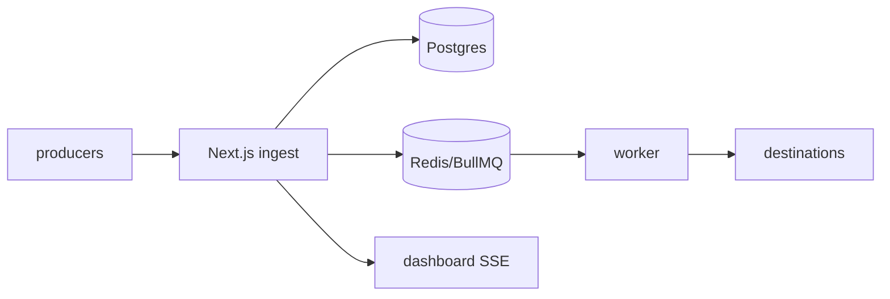

# HookRelay — durable webhook gateway

Self-hostable webhook ingestion, routing and replay: receive → verify → queue → transform → deliver with retries, live tail and replay.

> Scaffold status: monorepo + Docker + CI are live. Pipeline milestones (persist → queue → worker → dashboard → SDK/CLI) are stubbed and tracked below.

## Quickstart

```bash
cp apps/web/.env.example apps/web/.env
docker compose -f infra/docker-compose.yml up --build
# web → http://localhost:3000
curl -X POST localhost:3000/api/ingest/demo -H 'content-type: application/json' -d '{"hello":"world"}'
curl localhost:3000/api/health
```

Local dev without Docker:

```bash
pnpm install
pnpm dev  # turbo: web :3000 + worker
```

## Architecture

See [ARCHITECTURE.md](./ARCHITECTURE.md). One-liner: Next.js ingest API (HMAC + idempotency + rate-limit) → Postgres + BullMQ/Redis → Node worker (timeout, exp backoff x5, DLQ) → destinations, with SSE live-tail on the dashboard.



## Roadmap

- [x] Monorepo, Docker Compose, Railway Dockerfiles, CI
- [ ] Postgres persistence + idempotency + HMAC verify
- [ ] BullMQ worker: retries, DLQ, transforms
- [ ] Dashboard: events, delivery timeline, replay, charts
- [ ] SDK (`hookrelay-js`) + CLI + load-test results + demo GIF

## Security

See [SECURITY.md](./SECURITY.md). Please report vulnerabilities privately via GitHub Security Advisories.
