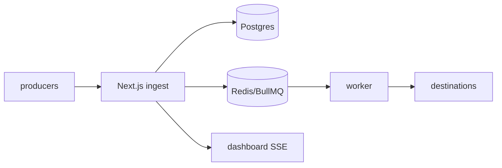

# HookRelay — durable webhook gateway

Self-hostable webhook ingestion, routing and replay: receive → verify → queue → transform → deliver with retries, live tail and replay.

> Status: ingest pipeline is live (HMAC verify → rate-limit → idempotency → Postgres → BullMQ). Worker delivery, dashboard and transforms are next.

## Quickstart

```bash
cp apps/web/.env.example apps/web/.env
docker compose -f infra/docker-compose.yml up -d postgres redis
pnpm install
pnpm --filter @hook-relay/web db:migrate
pnpm seed   # prints a signed curl for the demo source
# web → http://localhost:3000
curl localhost:3000/api/health
```

Signed ingest (unsigned requests get `401`; `pnpm seed` prints a ready-to-paste example):

```bash
curl -X POST localhost:3000/api/ingest/demo \
  -H 'content-type: application/json' \
  -H 'x-hookrelay-signature: sha256=<hex>' \
  -H 'idempotency-key: my-key-1' \
  -d '{"hello":"world"}'
# repeat with the same idempotency-key → 200 {"deduped":true, ...}, no duplicate delivery
```

Signatures are HMAC-SHA256 of the raw body (`hookrelay-js`):

```ts
import { sign } from "hookrelay-js";
await sign(SECRET, rawBody); // → "sha256=…"
```

Local dev without Docker:

```bash
pnpm install
pnpm dev  # turbo: web :3000 + worker
```

## Architecture

See [ARCHITECTURE.md](./ARCHITECTURE.md). One-liner: Next.js ingest API (HMAC + idempotency + rate-limit) → Postgres + BullMQ/Redis → Node worker (timeout, exp backoff x5, DLQ) → destinations, with SSE live-tail on the dashboard.



## Roadmap

- [x] Monorepo, Docker Compose, Railway Dockerfiles, CI
- [x] Postgres persistence + idempotency + HMAC verify + rate-limit + BullMQ enqueue
- [ ] BullMQ worker: retries, DLQ, transforms
- [ ] Dashboard: events, delivery timeline, replay, charts
- [ ] CLI + load-test results + demo GIF

## Security

See [SECURITY.md](./SECURITY.md). Please report vulnerabilities privately via GitHub Security Advisories.
